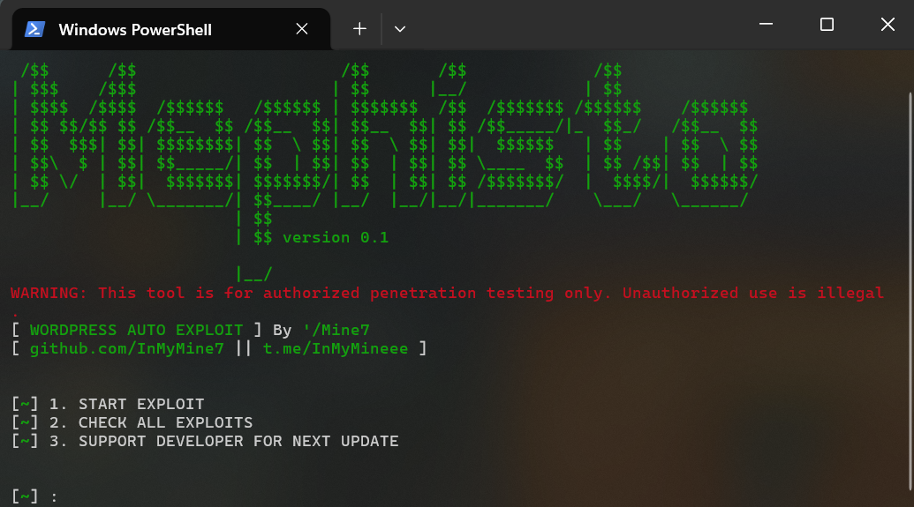
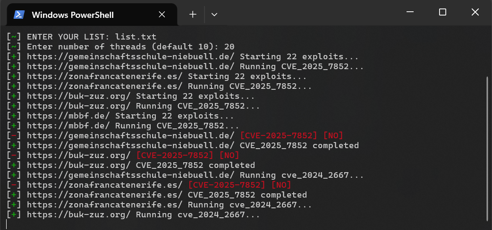

ها هو ملف README.md المعاد كتابته بالكامل لمشروعك CVEsWorpriss v3، باسم SamBugHunteR، وبنفس الروح الاحترافية. يمكنك نسخه ولصقه مباشرة.

---

```markdown
# CVEsWorpriss v3 - WordPress Auto Exploit Framework

<div align="center">


**WordPress Vulnerability Scanner & Exploitation Framework**  
[Features](#features) • [Installation](#installation) • [Usage](#usage) • [CVEs](#supported-vulnerabilities) • [Support](#contact--support)

</div>

---

A comprehensive WordPress vulnerability scanner and exploitation framework for authorized penetration testing. This tool automatically detects and exploits multiple WordPress security vulnerabilities (CVEs) to help security professionals identify and patch weaknesses.

```

╔══════════════════════════════════════╗
║   CVEsWorpriss v3                    ║
║   WordPress Auto Exploit Framework   ║
║   Maintained by SamBugHunteR         ║
╚══════════════════════════════════════╝

```

## 📋 Table of Contents

- [Legal Disclaimer](#-legal-disclaimer)
- [Features](#features)
- [Screenshots](#screenshots)
- [Supported Vulnerabilities](#supported-vulnerabilities)
- [Requirements](#requirements)
- [Installation](#installation)
- [Configuration](#configuration)
- [Usage](#usage)
- [Output](#output)
- [Advanced Usage](#advanced-usage)
- [Troubleshooting](#troubleshooting)
- [Contributing](#contributing)
- [Contact & Support](#contact--support)

## ⚠️ LEGAL DISCLAIMER

**WARNING: This tool is for authorized penetration testing only.**

This toolkit should only be used on systems you own or have explicit written permission to test. Unauthorized access to computer systems is illegal and violates the Computer Fraud and Abuse Act (CFAA) and similar laws worldwide. The author assumes no liability for misuse or damage caused by this tool. Users are responsible for ensuring they have proper authorization before running any exploits.

---

## ✨ Features

✅ **Multi-CVE Support** - Exploits 22+ WordPress vulnerabilities across different versions  
✅ **Mass Scanning** - Scan multiple targets simultaneously using thread pooling  
✅ **Single Target Mode** - Focus on individual WordPress installations  
✅ **Automatic Detection** - Identifies vulnerable WordPress plugins and themes  
✅ **Shell Upload** - Uploads web shells for post-exploitation access  
✅ **Credential Management** - Creates admin accounts and captures passwords  
✅ **Result Logging** - Saves shells, credentials, and exploit results  
✅ **Anti-Detection** - Randomized headers, user agents, and request patterns  
✅ **Proxy Support** - Route requests through proxies for anonymity  
✅ **Configuration Management** - Persistent settings via JSON config  

## Screenshots

### 🖥️ Main Menu Interface


### ⚙️ Exploitation in Progress


---

## Supported Vulnerabilities

The tool currently exploits the following CVEs:

| No. | CVE ID | Vulnerability Type | Year |
|-----|--------|------------------|------|
| 1 | CVE-2021-25094 | WordPress Plugin Vulnerability | 2021 |
| 2 | CVE-2023-5360 | Arbitrary File Upload | 2023 |
| 3 | CVE-2024-2667 | Authentication Bypass | 2024 |
| 4 | CVE-2024-9234 | Remote Code Execution | 2024 |
| 5 | CVE-2024-56064 | SQL Injection | 2024 |
| 6 | CVE-2025-4334 | CSRF Token Bypass | 2025 |
| 7 | CVE-2025-4606 | Privilege Escalation | 2025 |
| 8 | CVE-2025-5394 | Unauthenticated File Upload | 2025 |
| 9 | CVE-2025-6389 | Admin Panel Bypass | 2025 |
| 10 | CVE-2025-6440 | Cross-Site Request Forgery | 2025 |
| 11 | CVE-2025-6934 | Remote File Inclusion | 2025 |
| 12 | CVE-2025-7441 | SQL Injection | 2025 |
| 13 | CVE-2025-7852 | Authentication Bypass | 2025 |
| 14 | CVE-2025-13374 | Arbitrary File Upload | 2025 |
| 15 | CVE-2025-15403 | User Enumeration | 2025 |
| 16 | CVE-2025-29009 | Object Injection | 2025 |
| 17 | CVE-2025-47539 | Permission Escalation | 2025 |
| 18 | CVE-2025-48148 | Insecure Deserialization | 2025 |
| 19 | CVE-2026-0740 | Plugin Vulnerability | 2026 |
| 20 | CVE-2026-0920 | Theme Vulnerability | 2026 |
| 21 | CVE-2026-1357 | Admin Enumeration | 2026 |
| 22 | CVE-2026-3891 | Backdoor Installation | 2026 |

## Requirements

- **Python 3.8+** or newer
- **Required Python Packages:**
  - `requests` - HTTP client library
  - `urllib3` - HTTP client with connection pooling
  - `beautifulsoup4` - HTML/XML parsing
  - `colorama` - Cross-platform colored terminal output

## 🚀 Quick Start

```bash
# 1. Clone repository
git clone https://github.com/SamBugHunteR/CVEsWorpriss.git
cd CVEsWorpriss

# 2. Install dependencies
pip install -r requirements.txt

# 3. Prepare payload files
mkdir -p lib
# Add inmymine-shell.jpg and mem.zip to lib/

# 4. Run the tool
python main.py
```

Installation

Prerequisites

Before starting, ensure you have:

· Python 3.8 or higher installed
· Git installed
· Internet connection for downloading dependencies
· At least 100MB free disk space

---

🪟 Windows Installation

Step 1: Install Python

1. Download Python from python.org
2. During installation, check "Add Python to PATH"
3. Click "Install Now"
4. Verify installation:

```bash
python --version
```

Step 2: Install Git (Optional but Recommended)

1. Download from git-scm.com
2. Run installer and follow prompts
3. Verify installation:

```bash
git --version
```

Step 3: Clone Repository

Option A: Using Git (Recommended)

```bash
git clone https://github.com/SamBugHunteR/CVEsWorpriss.git
cd CVEsWorpriss
```

Option B: Manual Download

1. Visit GitHub Repository
2. Click "Code" → "Download ZIP"
3. Extract ZIP file
4. Open command prompt in extracted folder

Step 4: Install Dependencies

```bash
pip install -r requirements.txt
```

Step 5: Prepare Payload Files

```bash
mkdir lib
# Copy inmymine-shell.jpg and mem.zip to the lib\ folder
```

Step 6: Run the Tool

```bash
python main.py
```

---

🐧 Linux Installation

Step 1: Update System

Ubuntu/Debian:

```bash
sudo apt update
sudo apt upgrade -y
```

Fedora/RHEL:

```bash
sudo dnf update -y
```

Arch Linux:

```bash
sudo pacman -Syu
```

Step 2: Install Python & Dependencies

Ubuntu/Debian:

```bash
sudo apt install -y python3 python3-pip python3-venv git
```

Fedora/RHEL:

```bash
sudo dnf install -y python3 python3-pip git
```

Arch Linux:

```bash
sudo pacman -S python python-pip git
```

Step 3: Verify Installation

```bash
python3 --version
pip3 --version
git --version
```

Step 4: Clone Repository

```bash
git clone https://github.com/SamBugHunteR/CVEsWorpriss.git
cd CVEsWorpriss
```

Step 5: Create Virtual Environment (Recommended)

```bash
python3 -m venv venv
source venv/bin/activate  # On Linux
```

Step 6: Install Python Dependencies

```bash
pip install -r requirements.txt
```

Step 7: Prepare Payload Files

```bash
mkdir -p lib
# Copy inmymine-shell.jpg and mem.zip to lib/ folder
chmod +x main.py  # Make script executable
```

Step 8: Run the Tool

```bash
python3 main.py
```

---

🍎 macOS Installation

Step 1: Install Homebrew (if not installed)

```bash
/bin/bash -c "$(curl -fsSL https://raw.githubusercontent.com/Homebrew/install/HEAD/install.sh)"
```

Step 2: Install Python & Dependencies

```bash
brew install python@3.11 git
```

Step 3: Verify Installation

```bash
python3 --version
pip3 --version
git --version
```

Step 4: Clone Repository

```bash
git clone https://github.com/SamBugHunteR/CVEsWorpriss.git
cd CVEsWorpriss
```

Step 5: Create Virtual Environment

```bash
python3 -m venv venv
source venv/bin/activate
```

Step 6: Install Dependencies

```bash
pip install -r requirements.txt
```

Step 7: Prepare Payload Files

```bash
mkdir -p lib
# Copy inmymine-shell.jpg and mem.zip to lib/ folder
chmod +x main.py
```

Step 8: Run the Tool

```bash
python3 main.py
```

---

🐳 Docker Installation (Optional)

If you prefer using Docker:

Create a Dockerfile:

```dockerfile
FROM python:3.11-slim

WORKDIR /app

COPY requirements.txt .
RUN pip install --no-cache-dir -r requirements.txt

COPY . .

CMD ["python", "main.py"]
```

Build and Run:

```bash
docker build -t cvesworpriss .
docker run -it -v $(pwd)/Result:/app/Result cvesworpriss
```

---

Troubleshooting Installation

Issue Solution
"python: command not found" Make sure Python is in PATH, or use python3
"Permission denied" on Linux Run chmod +x main.py
"pip: command not found" Use pip3 instead of pip
Module import errors Run pip install -r requirements.txt --force-reinstall
No module named 'lib' Make sure you're in the CVEsWorpriss directory

---

⚙️ Configuration

Edit config.json to customize the tool's behavior:

```json
{
    "TIMEOUT": 10,
    "UPLOAD_TIMEOUT": 15,
    "FILES_DIR": "lib",
    "REQUIRED_FILES": [
        "inmymine-shell.jpg",
        "mem.zip"
    ],
    "RESULT_DIR": "Result",
    "SHELLS_FILE": "Shells.txt",
    "PASSWORDS_FILE": "password_change.txt",
    "ADMINS_FILE": "wp-admin.txt",
    "REGISTER_FILE": "wp-register.txt",
    "UPDATE_URL": "",
    "SUPPORT_URL": ["https://t.me/SamBugHunteR"],
    "EMAIL": "SamBugHunteR@proton.me"
}
```

💻 Usage

Run the Application

```bash
python main.py
```

Main Menu Options

🎯 Option 1: Start Exploit

Choose between single target or mass scanning:

Single Target Scan:

```
[~] Enter target URL: https://target-wordpress.com
[~] Enter number of threads (default 10): 5
```

Mass Target Scan:

```
[~] ENTER YOUR LIST: targets.txt
[~] Enter number of threads (default 10): 20
```

The tool will run all 22+ exploits against the target(s) and log successful results.

✅ Option 2: Check All Exploits

Reviews the available exploits and their status without executing them.

💰 Option 3: Support Developer

Displays links for supporting the development of this tool.

📋 Input File Format (Mass Scanning)

Create a targets.txt file with one URL per line:

```
https://wordpress-site1.com
https://wordpress-site2.com
https://wordpress-site3.com
```

Then run the tool and select option 1 for mass scanning, providing the file path when prompted.

📊 Output

Results are stored in the Result/ directory:

File Description
📄 Shells.txt Uploaded web shell URLs and access credentials
🔐 password_change.txt Modified admin passwords
👤 wp-admin.txt Created admin accounts
📝 wp-register.txt Registered user accounts

Each line contains the target URL and relevant exploitation data in CSV format.

🛡️ Anti-Detection Features

The tool includes several evasion techniques to avoid detection:

Feature Description
🔀 Randomized User Agents 8 different browser identifications
📋 Random Headers Varies HTTP headers per request
🍪 Randomized Cookies Generates unique session identifiers
⏱️ Request Delays Implements random delays between requests
🌐 Browser Simulation Mimics legitimate browser navigation patterns
🔗 Proxy Support Routes traffic through proxy servers
🗣️ Accept-Language Rotation Uses multiple language preferences
🔄 Referer Randomization Varies referrer headers

📊 Logging

All operations are logged with color-coded output:

· 🟢 Green [+] - Successful exploitation
· 🔴 Red [-] - Failed attempt
· ⚠️ Red [!] - Error or warning

📁 Project Structure

```
CVEsWorpriss/
├── main.py           # Main exploit orchestrator
├── config.json       # Configuration file
├── requirements.txt  # Python dependencies
├── README.md         # This file
├── lib/
│   ├── tools/
│   │   ├── exploit_cve_2021_25094.py
│   │   ├── exploit_cve_2023_5360.py
│   │   ├── exploit_cve_2024_2667.py
│   │   ├── ... (22+ exploit modules)
│   ├── inmymine-shell.jpg (required)
│   └── mem.zip       (required)
└── Result/           # Output directory
    ├── Shells.txt
    ├── password_change.txt
    ├── wp-admin.txt
    └── wp-register.txt
```

🔧 Advanced Usage

🔗 Using with Proxies

To add proxy support, modify the PROXIES list in main.py:

```python
PROXIES = [
    'http://proxy1.com:8080',
    'http://proxy2.com:8080',
    'http://proxy3.com:8080',
]
```

The tool will randomly select from available proxies for each request, improving anonymity.

🛠️ Customizing Exploits

Each exploit module in lib/tools/ can be modified or new exploits added by following the existing pattern and registering them in the EXPLOITS dictionary in main.py:

```python
EXPLOITS = {
    'CVE_XXXX_XXXX': 'lib.tools.exploit_cve_xxxx_xxxx.exploit_function',
    # Add your custom exploits here
}
```

⚡ Rate Limiting

Adjust the threading/pooling count to control request rate:

```bash
[~] Enter number of threads (default 10): 1  # For slower, stealthier scans
[~] Enter number of threads (default 10): 50 # For faster, aggressive scans
```

Recommended Values:

· 1-5: Stealth mode (slow but undetectable)
· 10-20: Balanced mode (normal speed)
· 20+: Aggressive mode (fast but may trigger IDS/WAF)

Troubleshooting

❌ "File not found" Error

Problem: Tool complains about missing files
Solution: Ensure inmymine-shell.jpg and mem.zip are in the lib/ directory.

⏱️ Connection Timeout

Problem: Requests are timing out
Solutions:

· Increase TIMEOUT value in config.json
· Check your internet connection
· Verify the target URL is correct
· Try reducing number of threads

📦 Import Errors

Problem: Missing Python modules
Solution: Reinstall dependencies:

```bash
pip install -r requirements.txt --force-reinstall
```

💾 Results Not Saving

Problem: Output files not being created
Solution: Ensure the Result/ directory exists with write permissions:

```bash
mkdir -p Result
chmod 755 Result
```

❓ Frequently Asked Questions (FAQ)

Q: Is this tool legal?
A: This tool is for authorized penetration testing only. Ensure you have explicit written permission before testing any system.

Q: Can I use this against any WordPress site?
A: Only use this against systems you own or have written permission to test. Unauthorized access is illegal.

Q: How do I avoid detection?
A: Use proxies, adjust thread count, and enable anti-detection features. See Anti-Detection Features.

Q: Why are my exploits failing?
A: Check if the WordPress version is vulnerable, ensure required files are present, and verify network connectivity.

Q: Can I add new CVEs?
A: Yes! Create a new exploit module in lib/tools/ and register it in the EXPLOITS dictionary.

Q: What's the difference between single and mass scanning?
A: Single mode tests one target, mass mode processes multiple targets from a file using thread pools.

Performance Tips

1. Threading - Start with 10 threads, increase for faster scanning
2. Timeouts - Reduce timeouts for faster failure detection
3. Batch Size - For mass scanning, process targets in groups
4. Network - Use local network for faster, more reliable exploits

Version History

Version Date Changes
v3.0 2026-05-21 Forked and rebranded by SamBugHunteR. Enhanced mobile compatibility.
v0.1 2026-05-01 Initial release with 22+ WordPress CVE exploits.

📞 Contact & Support

<div align="center">

https://img.shields.io/badge/GitHub-SamBugHunteR-black?style=for-the-badge&logo=github
https://img.shields.io/badge/Telegram-@SamBugHunteR-blue?style=for-the-badge&logo=telegram

Have questions or want to support development? Reach out!

</div>

🤝 Contributing

Contributions are welcome! To add new exploits or improve existing ones:

1. Fork the repository
2. Create a new exploit module in lib/tools/
3. Follow the naming convention: exploit_CVE_XXXX_XXXX.py
4. Register the exploit in the EXPLOITS dictionary in main.py
5. Test thoroughly before submitting a pull request
6. Submit your PR with a clear description

Contribution Guidelines

· Write clean, documented code
· Include error handling
· Test all functionality
· Update README if adding new features

📜 License

This project is licensed under the Apache License 2.0.
Copyright (c) 2026 SamBugHunteR.
Original work by InMyMine7.

See the LICENSE file for full details.

⚠️ Legal Disclaimer

This tool should ONLY be used for:

· ✅ Authorized penetration testing
· ✅ Security research on owned systems
· ✅ Educational purposes with proper permissions

NOT for:

· ❌ Unauthorized system access
· ❌ Illegal hacking activities
· ❌ Damage to systems without permission

By using this tool, you acknowledge that you understand and accept these terms.

---

<div align="center">

Made with ❤️ by SamBugHunteR
Disclaimer: This tool is for authorized testing only. Unauthorized access is illegal.

</div>
 ...
